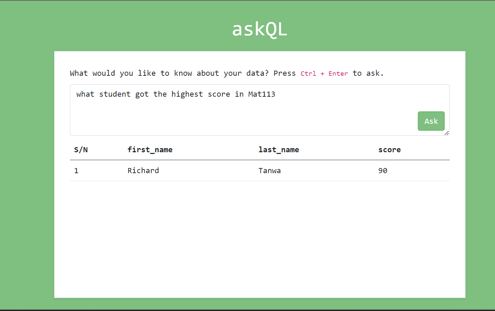
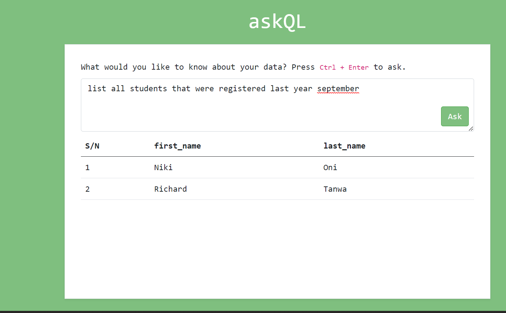
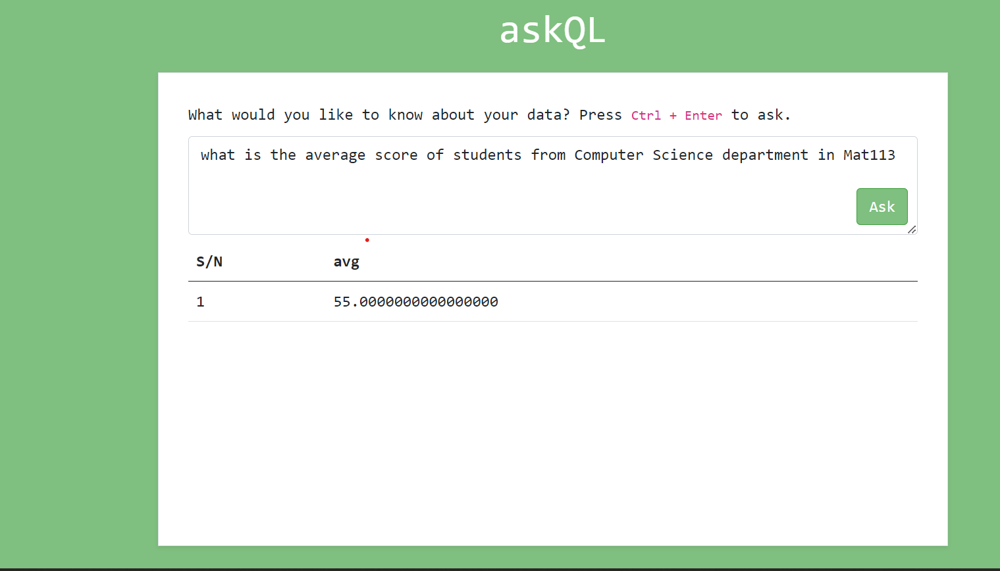

# ask-ql
A project that demonstrates querying Postgres (or any SQL DB) with plain English using GPT3

## Configuration

Rename the `.env.example` to `.env` and fill the variables with your details.

## Schema

Take a look at the `school.schema.json` file to understand how to represent your schema.

## Prerequisite

You need Node installed on you device.

## Building

Run the following commands on cloning the repository.

1. ` $ npm install `
2. ` $ npm run start `
3. ` $ npm run build `

## Issues
Raise it.
